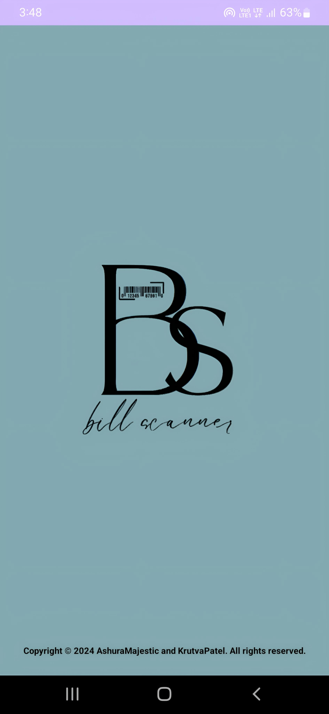
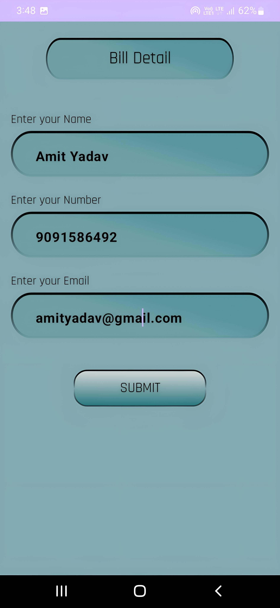
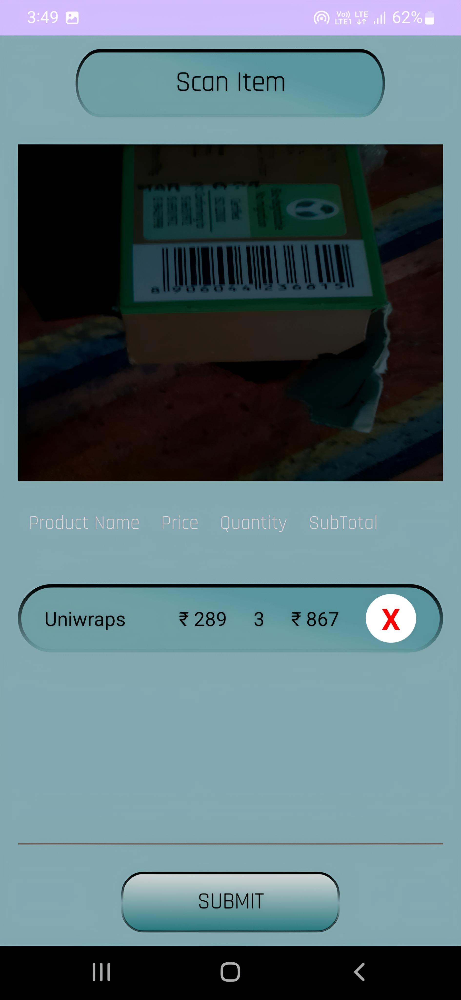
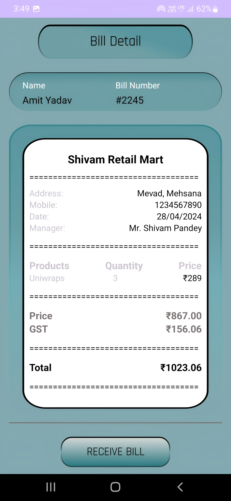
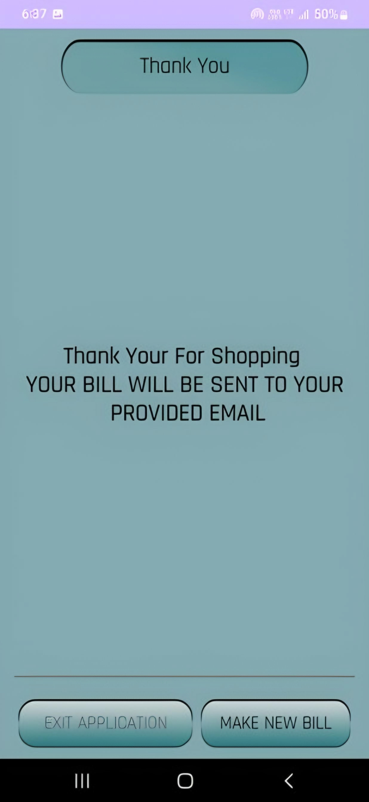
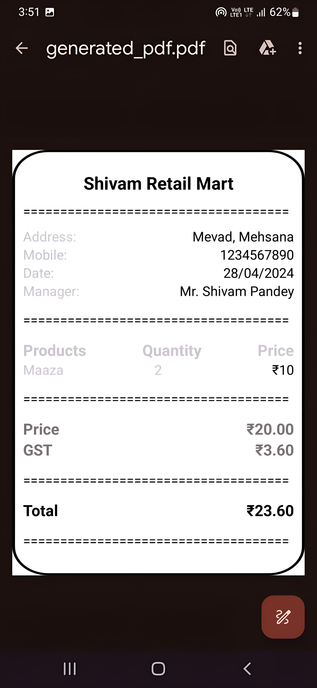

# Firebase Android Studio Project

This repository contains a sample Android Studio project integrated with Firebase services.

## Steps to Set Up

Follow these steps to set up the project:

### Step 1: Clone the Repository
Clone this repository to your local machine using the following command:

```bash
git clone https://github.com/AshuraMajestic/SmartMartPos.git
```

### Step 2: Open Project in Android Studio
Open the project in Android Studio by navigating to `File -> Open` and selecting the cloned repository directory.

### Step 3: Set Up Firebase Project
Create a new Firebase project on the [Firebase Console](https://console.firebase.google.com/) and add your Android app to it. Follow the on-screen instructions to download the `google-services.json` file and place it in the `app` directory of your project.

### Step 4: Connect Firebase to Android Studio
In your project's `build.gradle` file, add the following classpath dependency:

```gradle
classpath 'com.google.gms:google-services:4.3.10'
```

And in your app's `build.gradle` file, add the following plugin:

```gradle
apply plugin: 'com.google.gms.google-services'
```

### Step 5: Configure Firebase Services
Enable the Firebase services you want to use (e.g., Authentication, Firestore, Storage) in the Firebase console. Update the dependencies in your app's `build.gradle` file accordingly.

### Step 6: Run the App
Run the app on an emulator or physical device to ensure everything is set up correctly.

## APPLICATION PROCESSING AND DESIGN

### Step 1: opening Of Application with logo

{: width="300px" height="600"}


### Step 2: Enter my details

{: width="300px" height="600"}

### Step 3: Scanning barcodes and showing scanned products

{: width="300px" height="600"}

### Step 2: Generating the bill

{: width="300px" height="600"}


### Step 2: Bill downloaded and sent

{: width="300px" height="600"}


### Step 2: Bill Pdf

{: width="300px" height="600"}


# CREDITS
## Desinged BY : [Sugar]([URL](https://github.com/SuGAr9807)) (KRUTVA PATEL)

## Contributing

Contributions are welcome! Fork the repository and create a pull request with your changes.

## License

This project is licensed under the MIT License - see the [LICENSE](LICENSE) file for details.
